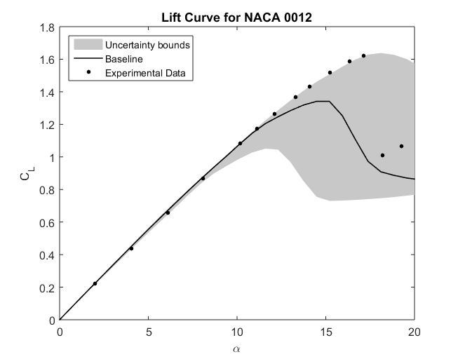
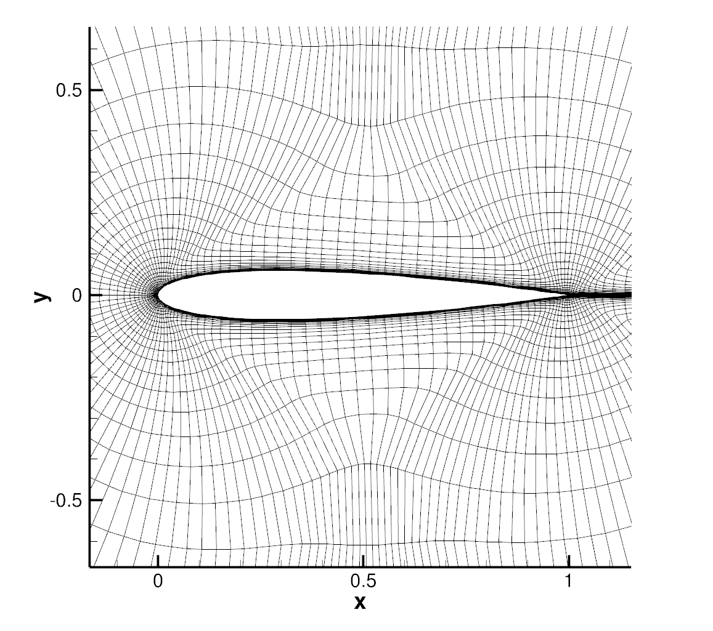

## Goals

This tutorial covers the EQUiPS (Enabling Quantification of Uncertainty in Physics-based Simulations) module implemented in SU2 that allows for the estimation of epistemic uncertainties arising from structural assumptions in RANS turbulence closures. The test case chosen for this is the NACA0012 airfoil where we will estimate the uncertainty in C<sub>L</sub> predictions at high angles of attack, as well as those in surface C<sub>P</sub> distributions at 2 different angles of attack. The following capabilities of SU2 will be showcased in this tutorial:

- Uncertainty Quantification (UQ) of the SST Turbulence Model
- compute_uncertainty.py: automates the UQ module
- Manual configuration options to perform UQ analysis


## Resources

The resources for this tutorial can be found in the [UQ_NACA0012](https://github.com/su2code/su2code.github.io/tree/master/UQ_NACA0012) directory in the [project website repository](https://github.com/su2code/su2code.github.io). You will need the configuration file ([turb_NACA0012_uq.cfg](../../UQ_NACA0012/turb_NACA0012_uq.cfg)) and the mesh file ([mesh_n0012_225-65.su2](../../UQ_NACA0012/mesh_n0012_225-65.su2)). 

## Tutorial

The following tutorial will walk you through the steps required when using the EQUiPS module for estimating uncertainties in CFD predictions arising due to assumptions made in turbulence models. The tutorial will also address procedures for both serial and parallel computations. To this end, it is assumed you have already obtained and compiled SU2_CFD. If you have yet to complete these requirements, please see the [Download](/docs/Download/) and [Installation](/docs/Installation/) pages.


### Background

This test case is for the NACA 0012 airfoil in viscous flow. This is a simple 2D geometry that stalls, and exhibits seperated flow, at high angles of attack. It is a ubiquitous geometry that has significant amounts of experimental data available that allows for the comparison of lower fidelity RANS CFD simulations, to the higher fidelity wind tunnel tests that have been conducted.  


### Problem Setup

This problem will solve the flow past the airfoil with these conditions:
- Freestream Temperature = 300 K
- Freestream Mach number = 0.15
- Angle of attack (AOA) = from 0deg to 20deg
- Reynolds number = 6.02E6
- Reynolds length = 1.0 m

Performing the simulations at a range of angles of attack allows the exploration of the various flow regimes that occur. At low angles of attack, the flow stays attached and the 

### Mesh Description

The mesh used is a structured C-grid. The farfield boundary extends 500c away from the airfoil surface. The airfoil surface is treated as a Navier-Stokes wall (non-slip). This can be seen in Figure (1).


Figure (1): Zoomed in view of mesh near airfoil.


### Configuration File Options

Several of the key configuration file options for this simulation are highlighted here. We next discuss the proper way to prescribe 3D, viscous, compressible flow conditions in SU2:

```
% -------------------- COMPRESSIBLE FREE-STREAM DEFINITION --------------------%
%
% Mach number (non-dimensional, based on the free-stream values)
MACH_NUMBER= 0.8395
%
% Angle of attack (degrees, only for compressible flows)
AOA= 3.06
%
% Side-slip angle (degrees, only for compressible flows)
SIDESLIP_ANGLE= 0.0
%
% Init option to choose between Reynolds (default) or thermodynamics quantities
% for initializing the solution (REYNOLDS, TD_CONDITIONS)
INIT_OPTION= REYNOLDS
%
% Free-stream option to choose between density and temperature (default) for
% initializing the solution (TEMPERATURE_FS, DENSITY_FS)
FREESTREAM_OPTION= TEMPERATURE_FS
%
% Free-stream temperature (288.15 K by default)
FREESTREAM_TEMPERATURE= 288.15
%
% Reynolds number (non-dimensional, based on the free-stream values)
REYNOLDS_NUMBER= 11.72E6
%
% Reynolds length (1 m by default)
REYNOLDS_LENGTH= 0.64607
```

The options above set the conditions for a 3D, viscous flow. The `MACH_NUMBER`, `AOA`, and `SIDESLIP_ANGLE` options remain the same as they appeared for the inviscid ONERA M6 tutorial, which includes a description of the freestream flow direction. 

For this problem, SU2 is using a calorically perfect gas model which is selected by setting the `FLUID_MODEL` to `STANDARD_AIR`. The fluid flow properties can be changed by selecting a different fluid model. In addition, the models for the transport coefficients can also be customized by exploring the viscosity and thermal conductivity options. By default with compressible flow, the laminar viscosity is governed by Sutherland's law, and the thermal conductivity is assumed to depend on a constant Prandtl number.

```
% ---- IDEAL GAS, POLYTROPIC, VAN DER WAALS AND PENG ROBINSON CONSTANTS -------%
%
% Different gas model (STANDARD_AIR, IDEAL_GAS, VW_GAS, PR_GAS)
FLUID_MODEL= STANDARD_AIR
%
% Ratio of specific heats (1.4 default and the value is hardcoded
%                          for the model STANDARD_AIR)
GAMMA_VALUE= 1.4
%
% Specific gas constant (287.058 J/kg*K default and this value is hardcoded 
%                        for the model STANDARD_AIR)
GAS_CONSTANT= 287.058

% --------------------------- VISCOSITY MODEL ---------------------------------%
%
% Viscosity model (SUTHERLAND, CONSTANT_VISCOSITY).
VISCOSITY_MODEL= SUTHERLAND
%
% Sutherland Viscosity Ref (1.716E-5 default value for AIR SI)
MU_REF= 1.716E-5
%
% Sutherland Temperature Ref (273.15 K default value for AIR SI)
MU_T_REF= 273.15
%
% Sutherland constant (110.4 default value for AIR SI)
SUTHERLAND_CONSTANT= 110.4

% --------------------------- THERMAL CONDUCTIVITY MODEL ----------------------%
%
% Conductivity model (CONSTANT_CONDUCTIVITY, CONSTANT_PRANDTL).
CONDUCTIVITY_MODEL= CONSTANT_PRANDTL
%
% Laminar Prandtl number (0.72 (air), only for CONSTANT_PRANDTL)
PRANDTL_LAM= 0.72
%
% Turbulent Prandtl number (0.9 (air), only for CONSTANT_PRANDTL)
PRANDTL_TURB= 0.90
```

Initialization of the flow field for compressible problems can be performed by multiple methods. The default method is to intitialize using the specified Reynolds number (`INIT_OPTION= REYNOLDS`) and free-stream temperature (`FREESTREAM_OPTION= TEMPERATURE_FS`), which will be used in this case. It is also possible to initialize the flow from thermodynamic quantities directly with `INIT_OPTION= TD_CONDITIONS`, in which case, the Reynolds number option will be ignored. Regardless of initialization method, we recommend that you always confirm the resulting initialization state in the console output during runtime of SU2 that is reported just before the solver begins iterating.

 For a viscous simulation, the numerical experiment must match the physical reality. This flow similarity is achieved by matching the `REYNOLDS_NUMBER` and `REYNOLDS_LENGTH` to the original system (assuming the Mach number and the geometry already match). Upon starting a viscous simulation in SU2, the following steps are performed to set the flow conditions internally when `INIT_OPTION= REYNOLDS` and `FREESTREAM_OPTION= TEMPERATURE_FS`:
 1. Use the gas constants and freestream temperature to calculate the speed of sound.
 2. Calculate the freestream velocity vector from the Mach number, `AOA`/`SIDESLIP_ANGLE`, and speed of sound from step 1.
 3. Compute the freestream viscosity by using the viscosity model specified in the config file.
 4. Use the definition of the Reynolds number to find the freestream density from the supplied Reynolds information, freestream velocity, and freestream viscosity from step 3.
 5. Calculate the freestream pressure using the perfect gas law with the freestream temperature, specific gas constant, and freestream density from step 4. Note that the freestream pressure supplied in the configuration file will be ignored with this method of initialization.

This method for setting similar flow conditions assumes that all inputs are in SI units, including the mesh geometry, which should be in *meters*. As described in the inviscid wedge tutorial, you can easily scale your mesh file to the appropriate size with the SU2_DEF module.

Lastly, SU2 features multiple ways to assess convergence:

```
% Convergence criteria (CAUCHY, RESIDUAL)
CONV_CRITERIA= CAUCHY
%
% Number of elements to apply the criteria
CAUCHY_ELEMS= 100
%
% Epsilon to control the series convergence
CAUCHY_EPS= 1E-6
%
% Function to apply the criteria (LIFT, DRAG, NEARFIELD_PRESS, SENS_GEOMETRY,
% SENS_MACH, DELTA_LIFT, DELTA_DRAG)
CAUCHY_FUNC_FLOW= DRAG 
```

Rather than achieving a certain order of magnitude in the density residual to judge convergence, what we call the Cauchy convergence criteria is chosen for this problem. This type of criteria measures the change in a specific quantity of interest over a specified number of previous iterations. With the options selected above, the calculation will terminate when the change in the drag coefficient (`CAUCHY_FUNC_FLOW`) for the wing over the previous 100 iterations (`CAUCHY_ELEMS`) becomes less than 1E-6 (`CAUCHY_EPS`). A convergence criteria of this nature can be very useful for design problems where the solver is embedded in a larger design loop and reliable convergence behavior is essential.


### Running SU2

Instructions for running this test case are given here for both serial and parallel computations.

#### In Serial

The wing mesh should fit on a single-core machine. To run this test case in serial, follow these steps at a terminal command line:
 1. Move to the directory containing the config file (turb_ONERAM6.cfg) and the mesh file (mesh_ONERAM6_turb_hexa_43008.su2). Make sure that the SU2 tools were compiled, installed, and that their install location was added to your path.
 2. Run the executable by entering in the command line:
      
    ```
    $ SU2_CFD turb_ONERAM6.cfg
    ```

 3. SU2 will print residual updates with each iteration of the flow solver, and the simulation will terminate after reaching the specified convergence criteria.
 4. Files containing the results will be written upon exiting SU2. The flow solution can be visualized in ParaView (.vtk) or Tecplot (.dat for ASCII).

#### In Parallel

If SU2 has been built with parallel support, the recommended method for running a parallel simulation is through the use of the parallel_computation.py Python script. This automatically handles the domain decomposition and execution with SU2_CFD, and the merging of the decomposed files using SU2_SOL. Follow these steps to run the ONERA M6 case in parallel:
 1. Move to the directory containing the config file ([turb_ONERAM6.cfg](../../Turbulent_ONERAM6/turb_ONERAM6.cfg)) and the mesh file ([mesh_ONERAM6_turb_hexa_43008.su2](../../Turbulent_ONERAM6/mesh_ONERAM6_turb_hexa_43008.su2)). Make sure that the SU2 tools were compiled with parallel support, installed, and that their install location was added to your path.
 2. Run the python script which will automatically call SU2_CFD and will perform the simulation using `NP` number of processors by entering in the command line:

    ```
    $ parallel_computation.py -n NP -f turb_ONERAM6.cfg
    ```

 3. SU2 will print residual updates with each iteration of the flow solver, and the simulation will terminate after reaching the specified convergence criteria.
 4. The python script will automatically call the `SU2_SOL` executable for generating visualization files from the native restart file written during runtime. The flow solution can then be visualized in ParaView (.vtk) or Tecplot (.dat for ASCII).

### Results

Results for the turbulent flow over the ONERA M6 wing are shown below. As part of this tutorial a coarse mesh has been provided, but for comparison the results obtained by using a refined mesh (9,252,922 nodes) as well as experimental results are shown.


Figure (3): Comparison of Cp profiles of the experimental results of Schmitt and Carpin (red squares) against SU2 computational results (blue line) at different sections along the span of the wing. (a) y/b = 0.2, (b) y/b = 0.65, (c) y/b = 0.8, (d) y/b = 0.95.
